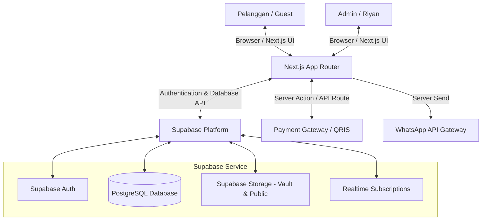
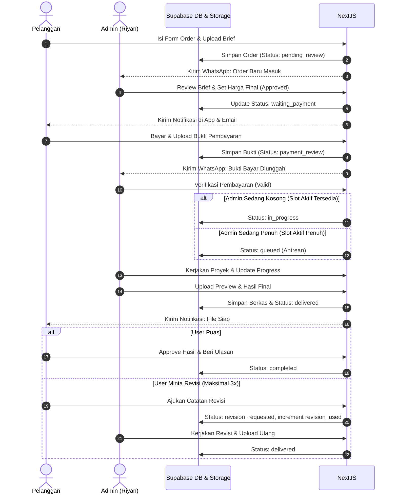

# Single Source of Truth (SSOT) - FlashWork

Dokumen ini adalah **Single Source of Truth (SSOT)** resmi untuk proyek **FlashWork**. Dokumen ini berfungsi sebagai referensi utama bagi AI Agent, developer, maintainer, dan kontributor untuk memahami, memelihara, serta mengembangkan sistem FlashWork secara konsisten dan aman.

---

## 1. Ringkasan Project

### 1.1 Nama & Tagline
* **Nama Proyek**: FlashWork
* **Tagline**: Cepat, rapi, dan terarah untuk kebutuhan akademik dan digital.
* **Kategori Produk**: Academic & Digital Service Platform

### 1.2 Tujuan Proyek
Mengubah operasional bisnis personal Riyan Perdhana Putra dalam melayani permintaan bantuan akademik dan digital (yang sebelumnya dikelola secara manual melalui chat WhatsApp) menjadi platform digital terintegrasi yang profesional, transparan, terukur, dan aman.

### 1.3 Fungsi Utama
* **Landing Page Premium**: Membangun kepercayaan dengan tampilan modern, portofolio yang aman, FAQ, dan price estimator.
* **Dashboard Pengguna (User Dashboard)**: Pusat kendali pelanggan untuk membuat pesanan, melacak status real-time, mengunggah brief, melakukan pembayaran, mengunduh hasil final, mengajukan revisi, dan berdiskusi di forum.
* **Dashboard Admin (Admin Dashboard)**: Pusat kendali operasional bagi admin (Riyan) untuk meninjau order, menentukan harga final, mengelola antrean kerja (workload control), memverifikasi pembayaran, mengirimkan file hasil, dan memoderasi forum.
* **Sistem Antrean (Pending Queue)**: Membatasi beban kerja aktif admin dengan menahan pesanan berbayar di antrean jika kapasitas kerja penuh (`max_active_orders`).
* **Sistem Revisi Terbatas**: Membatasi revisi maksimal 3x per order berdasarkan brief awal yang disepakati untuk mencegah eksploitasi waktu kerja.
* **Sistem File Vault**: Penyimpanan berkas secara aman di mana file hasil final hanya dapat diunduh setelah pembayaran terverifikasi valid/lunas.
* **Notification Center & WhatsApp Automation**: Mengirimkan notifikasi real-time di web dan pesan otomatis ke WhatsApp Admin mengenai aktivitas penting proyek.
* **Forum Komunitas**: Ruang interaksi internal bagi pengguna untuk berdiskusi seputar dunia akademik dan pemrograman.

### 1.4 Branding & Etika Publik
* **Positioning Aman**: Di sisi publik, FlashWork diposisikan sebagai platform "pendampingan akademik", "bantuan teknis", "konsultasi", "debugging", "revisi", dan "digital service". Istilah internal seperti "jokian" tidak boleh digunakan dalam publikasi publik atau landing page.
* **Prinsip Etika**: Layanan difokuskan pada konsultasi, bimbingan, pemrograman/debugging, desain UI/UX, dan perapian makalah. FlashWork berkomitmen untuk tidak mendukung kecurangan akademis seperti ujian langsung, plagiarisme mutlak, atau manipulasi data yang tidak etis.

---

## 2. Arsitektur Sistem

Sistem FlashWork dibangun di atas arsitektur modern berbasis cloud dengan stack teknologi berikut:



### 2.1 Komponen Utama
* **Frontend Layer**: Next.js App Router dengan Tailwind CSS untuk styling, shadcn/ui untuk komponen UI, dan Framer Motion untuk animasi micro-interaction.
* **Backend Layer**: Next.js Server Actions dan API Routes (Route Handlers) yang menangani logika otorisasi tingkat lanjut, perhitungan harga, interaksi API eksternal, dan integrasi webhook.
* **Database & Auth Layer**: Supabase Auth untuk manajemen sesi JWT dan Supabase PostgreSQL untuk penyimpanan data relasional terstruktur.
* **Storage Layer**: Supabase Storage untuk mengelola berkas unggahan pengguna dan admin menggunakan bucket privat dengan Signed URLs yang dilindungi RLS.
* **Realtime Engine**: Supabase Realtime untuk menyiarkan notifikasi langsung (in-app notifications) tanpa polling.
* **Notifikasi WhatsApp**: Integrasi dengan API gateway pihak ketiga untuk mengirim notifikasi operasional krusial kepada admin.

---

## 3. Struktur Folder dan File

Sebagai proyek yang baru diinisialisasi (clean state), struktur folder dan file berikut wajib dipatuhi dan diimplementasikan:

```
flashwork/
├── app/                              # Next.js App Router (Routing & Pages)
│   ├── (public)/                     # Rute publik (tanpa login)
│   │   ├── page.tsx                  # Landing page utama
│   │   └── services/                 # Detail layanan publik
│   ├── (auth)/                       # Rute autentikasi
│   │   ├── login/                    # Halaman login
│   │   └── register/                 # Halaman pendaftaran
│   ├── dashboard/                    # Area terproteksi login
│   │   ├── layout.tsx                # Sidebar & Topbar dashboard wrapper
│   │   ├── user/                     # Panel khusus pelanggan
│   │   │   ├── page.tsx              # Overview order & notifikasi pelanggan
│   │   │   ├── order/                # Alur pembuatan order baru
│   │   │   └── order/[id]/           # Detail order, timeline, upload bukti, file vault
│   │   └── admin/                    # Panel khusus Admin (Riyan)
│   │       ├── page.tsx              # Dashboard stats & ringkasan bisnis
│   │       ├── queue/                # Kanban board antrean pesanan
│   │       └── order/[id]/           # Detil administrasi, edit harga, upload final, revisi
│   ├── forum/                        # Forum internal
│   │   ├── page.tsx                  # List thread forum berdasarkan kategori
│   │   └── thread/[id]/              # Halaman thread diskusi & komentar
│   └── api/                          # Next.js API Routes (Route Handlers)
│       ├── payments/webhook/         # Webhook dari payment gateway (status otomatis)
│       └── whatsapp/send/            # Endpoint internal pemicu notifikasi WA
├── components/                       # React Components Reusable
│   ├── ui/                           # Komponen visual dasar (shadcn/ui)
│   ├── landing/                      # Komponen khusus Landing Page (Hero, FAQ, Estimator)
│   ├── dashboard/                    # Komponen layout panel (Sidebar, Topbar, UserWidget)
│   ├── orders/                       # Komponen pesanan (Timeline, OrderCard, PriceTag)
│   ├── files/                        # File previewer & uploader handler
│   └── forum/                        # Komponen forum (ThreadCard, CommentForm)
├── lib/                              # Utilitas dan helper logika bisnis
│   ├── supabase/                     # Inisialisasi Supabase Client & Server
│   │   ├── client.ts                 # Supabase client untuk Client Components
│   │   ├── server.ts                 # Supabase client untuk Server Components/Actions
│   │   └── middleware.ts             # Auth session handler & route protection
│   ├── pricing.ts                    # Aturan formula perhitungan harga estimasi otomatis
│   ├── whatsapp.ts                   # Integrasi pengiriman API WhatsApp
│   └── permissions.ts                # Helper pengecekan otorisasi berbasis user role
├── types/                            # Type Definitions TypeScript
│   ├── database.ts                   # Autogenerated types dari schema Supabase
│   ├── order.ts                      # Tipe data entitas order & status
│   └── payment.ts                    # Tipe data entitas invoice & transaksi
└── SSOT.md                           # Dokumen Single Source of Truth proyek (Dokumen ini)
```

---

## 4. Flow Sistem

### 4.1 Flow Bisnis Utama (Order-to-Delivery)



### 4.2 Alur Penanganan Error (Error Flows)
* **Kegagalan Upload File**: Jika pengunggahan berkas ke Supabase Storage terputus di tengah jalan, sistem tidak akan menyimpan record database. Berkas parsial yang terlanjur masuk harus dibersihkan secara terjadwal.
* **Kegagalan API WhatsApp**: Jika gateway WhatsApp mengalami kegagalan/timeout, transaksi database utama **tidak boleh dibatalkan**. Kegagalan dicatat dalam `activity_logs` agar admin dapat memeriksanya nanti secara manual dari dashboard.
* **Kegagalan Webhook Pembayaran**: Jika status pembayaran tidak berubah otomatis karena webhook gagal, admin memiliki fitur bypass manual pada Dashboard Admin untuk memvalidasi pembayaran berdasarkan bukti transfer fisik.

---

## 5. Penyimpanan Data

### 5.1 Skema Database PostgreSQL (Tabel Utama)

#### A. Tabel `profiles`
Menyimpan data otentik pengguna yang terhubung langsung dengan Supabase Auth (`auth.users`).
* `id` (uuid, primary key) -> Mereferensikan `auth.users(id)`
* `full_name` (text, not null)
* `phone` (text) -> Nomor WhatsApp aktif
* `role` (text, default: 'user') -> Kontrol akses: `user`, `admin`, `partner`
* `avatar_url` (text)
* `created_at` (timestamptz)
* `updated_at` (timestamptz)

#### B. Tabel `services`
Menyimpan daftar kategori layanan yang ditawarkan.
* `id` (uuid, primary key)
* `name` (text, not null) -> Contoh: 'Laporan & Makalah', 'PPT Presentasi', 'Coding & Website'
* `slug` (text, unique)
* `category` (text)
* `description` (text)
* `base_price` (integer, default: 0)
* `min_price` (integer)
* `max_price` (integer)
* `is_active` (boolean, default: true)

#### C. Tabel `orders`
Tabel utama transaksi pesanan pelanggan.
* `id` (uuid, primary key)
* `order_code` (text, unique) -> Format: `FW-[TAHUN]-[URUTAN]` (contoh: `FW-2026-0001`)
* `user_id` (uuid) -> Relasi ke `profiles(id)`
* `service_id` (uuid) -> Relasi ke `services(id)`
* `title` (text, not null) -> Judul tugas/tujuan order
* `description` (text, not null) -> Deskripsi / Brief instruksi
* `deadline` (timestamptz) -> Batas waktu pengerjaan
* `difficulty` (text, default: 'normal') -> Pilihan: `easy`, `normal`, `hard`, `complex`
* `priority` (text, default: 'normal') -> Paket SLA: `normal`, `cepat`, `express`, `super_urgent`
* `estimated_price` (integer) -> Estimasi otomatis awal oleh sistem
* `final_price` (integer) -> Harga final yang ditentukan admin
* `status` (text, default: 'pending_review') -> Lihat bagian 5.2 (Enum Status)
* `progress` (integer, default: 0) -> Nilai progress 0 - 100%
* `revision_limit` (integer, default: 3) -> Batasan kuota revisi (default 3)
* `revision_used` (integer, default: 0) -> Jumlah revisi yang sudah digunakan
* `admin_note` (text) -> Catatan instruksi/informasi dari admin
* `created_at` (timestamptz)
* `updated_at` (timestamptz)

#### D. Tabel `order_files`
Menyimpan metadata berkas pendukung maupun berkas hasil.
* `id` (uuid, primary key)
* `order_id` (uuid) -> Relasi ke `orders(id)`
* `uploaded_by` (uuid) -> Relasi ke `profiles(id)`
* `file_name` (text)
* `file_url` (text) -> Path berkas di Supabase Storage
* `file_size` (integer) -> Ukuran berkas dalam bytes
* `file_type` (text) -> MIME type berkas
* `file_category` (text) -> Klasifikasi: `user_attachment`, `admin_preview`, `admin_final`, `revision_attachment`
* `created_at` (timestamptz)

#### E. Tabel `payments`
Menyimpan riwayat invoice dan transaksi pembayaran.
* `id` (uuid, primary key)
* `order_id` (uuid) -> Relasi ke `orders(id)`
* `amount` (integer, not null)
* `method` (text) -> Metode: `bank_transfer`, `qris_manual`, `qris_gateway`
* `status` (text, default: 'unpaid') -> Pilihan: `unpaid`, `pending_verification`, `paid`, `rejected`, `expired`, `refunded`
* `proof_url` (text) -> Bukti transfer (private bucket storage)
* `gateway_reference` (text) -> ID transaksi dari payment gateway (jika ada)
* `paid_at` (timestamptz)
* `created_at` (timestamptz)

#### F. Tabel `revisions`
Menyimpan riwayat pengajuan revisi.
* `id` (uuid, primary key)
* `order_id` (uuid) -> Relasi ke `orders(id)`
* `user_id` (uuid) -> Relasi ke `profiles(id)`
* `revision_number` (integer) -> Urutan revisi (1, 2, atau 3)
* `note` (text, not null) -> Deskripsi revisi dari user
* `attachment_url` (text) -> File pendukung revisi dari user
* `status` (text, default: 'pending') -> Pilihan: `pending`, `in_progress`, `resolved`, `rejected`
* `admin_response` (text) -> Tanggapan dari admin setelah dikerjakan/ditolak
* `created_at` (timestamptz)

#### G. Tabel `activity_logs`
Tabel audit log sistem untuk melacak aktivitas operasional.
* `id` (uuid, primary key)
* `user_id` (uuid) -> Relasi ke `profiles(id)` (null jika sistem otomatis)
* `action` (text) -> Jenis aksi, contoh: `ORDER_APPROVED`, `PAYMENT_VERIFIED`
* `details` (jsonb) -> Data detail perubahan (payload sebelum/sesudah)
* `ip_address` (text)
* `created_at` (timestamptz)

#### H. Tabel `settings`
Menyimpan konfigurasi dinamis sistem yang dapat diubah admin.
* `id` (uuid, primary key)
* `key` (text, unique) -> Contoh: `max_active_orders`, `admin_whatsapp_number`, `mode_sibuk`
* `value` (text)
* `updated_at` (timestamptz)

---

### 5.2 Enum Status Order
Nilai status berikut wajib diimplementasikan secara konsisten pada kolom `orders.status`:
1. `draft`: Pengguna belum menyelesaikan pengisian formulir order.
2. `pending_review`: Pesanan baru dibuat, menunggu ulasan admin.
3. `need_detail`: Admin meminta detail tambahan/file brief dari pengguna.
4. `rejected`: Pesanan ditolak oleh admin (deadline tidak logis, melanggar ketentuan, dll).
5. `approved`: Pesanan disetujui, harga final ditetapkan, invoice diterbitkan.
6. `waiting_payment`: Menunggu pembayaran dari pengguna.
7. `payment_review`: Pengguna telah mengunggah bukti bayar, menunggu verifikasi admin.
8. `queued`: Pembayaran valid, pesanan masuk antrean karena slot aktif admin sedang penuh.
9. `in_progress`: Pesanan sedang dikerjakan secara aktif oleh admin.
10. `delivered`: File hasil (atau preview) telah diunggah admin ke dashboard.
11. `revision_requested`: Pengguna meminta revisi (sisa kuota dikurangi).
12. `revision_in_progress`: Revisi sedang dikerjakan secara aktif oleh admin.
13. `completed`: Pesanan selesai (pengguna menerima hasil/kuota revisi habis).
14. `cancelled`: Pesanan dibatalkan.

---

### 5.3 Supabase Storage Buckets
Pembagian hak akses bucket wajib diatur menggunakan RLS Storage:
* **Private Bucket**: `orders`
  * Akses: Hanya Admin dan User pemilik order (`user_id` pemilik order) yang dapat mengunduh berkas.
  * Struktur Folder:
    * `/orders/{order_code}/user-files/` -> File brief dari user.
    * `/orders/{order_code}/preview-files/` -> File preview admin.
    * `/orders/{order_code}/final-files/` -> File hasil akhir.
    * `/orders/{order_code}/revision-files/` -> File kelengkapan revisi.
* **Public Bucket**: `forum` & `avatars`
  * Akses: Siapa pun (termasuk guest/user terotentikasi) dapat membaca berkas. Write akses dibatasi untuk user terotentikasi.

---

## 6. Integrasi Eksternal

### 6.1 WhatsApp Gateway (Notifikasi Admin)
Sistem akan memicu notifikasi otomatis ke nomor WhatsApp Admin untuk event penting.
* **Format Pesan**: Menggunakan text-template terstruktur.
* **Payload API**:
  ```json
  {
    "target": "NOMOR_WHATSAPP_ADMIN",
    "message": "Template teks terformat sesuai jenis event"
  }
  ```
* **Daftar Event Wajib WA**:
  1. **Order Baru Masuk**: Dipicu saat user submit order baru.
  2. **Bukti Pembayaran Diunggah**: Dipicu saat user upload bukti bayar.
  3. **Revisi Diminta**: Dipicu saat user klik "Request Revisi".
  4. **Peringatan Deadline**: Terjadwal ketika sisa waktu pengerjaan kurang dari 6 jam.

### 6.2 Payment Gateway (Midtrans / Xendit)
* **Mode MVP**: Menggunakan QRIS manual. User mengunduh gambar QRIS statis dan mengunggah bukti transfer manual (`payments.proof_url`).
* **Mode Growth**: Integrasi API Midtrans/Xendit untuk menghasilkan QRIS dinamis unik. Status otomatis diubah via webhook (`/api/payments/webhook`).
* **Aturan Keamanan Webhook**:
  * Wajib memverifikasi Signature Key/Token webhook untuk memastikan request asli dari payment gateway.
  * Nominal yang dibayarkan wajib divalidasi dengan database (`payments.amount`), bukan mempercayai nominal dari payload frontend.

---

## 7. Logging dan Monitoring

### 7.1 Tabel `activity_logs`
Setiap mutasi status atau data penting wajib dicatat dalam log database untuk kepentingan audit dan keamanan.
* **Aksi yang Wajib Dicatat**:
  * Pembuatan akun baru (`user_registered`).
  * Pembuatan order (`order_created`).
  * Perubahan harga final (`price_finalized` oleh admin).
  * Validasi pembayaran (`payment_verified`).
  * Upload file hasil final (`file_delivered`).
  * Pengajuan revisi (`revision_requested`).
  * Pembatalan order (`order_cancelled`).

### 7.2 Log Tingkat Server (Runtime Console)
Seluruh error pada API routes, server actions, dan integrasi WhatsApp wajib dibungkus dalam blok `try-catch` dengan logging stderr terperinci untuk kemudahan debugging di console Vercel/Node:
```typescript
console.error(`[ERR_WHATSAPP_NOTIFICATION] Failed to send message for order ${orderCode}:`, error);
```

---

## 8. Error Handling

### 8.1 Strategi Penanganan Error
* **Database Rollback**: Setiap transaksi kompleks (seperti pembuatan order yang membutuhkan insert data order dan pembuatan relasi data file) wajib menggunakan RPC PostgreSQL atau transaction block Supabase untuk mencegah data yatim piatu.
* **Retry Policy**: API request eksternal yang gagal (seperti WhatsApp Gateway) harus dicoba ulang (retry) maksimal 3 kali sebelum menyerah dan mencatat status error ke dalam `activity_logs`.
* **Timeout Limit**: Semua endpoint API internal dibatasi dengan timeout maksimal 15 detik untuk menghindari penumpukan request serverless yang menggantung.

---

## 9. Keamanan

### 9.1 Validasi Input
* Semua input form wajib divalidasi di sisi client dan server menggunakan skema validasi **Zod**.
* **Proteksi File**:
  * Batasi ukuran file unggahan maksimal 25 MB.
  * Batasi ekstensi yang diizinkan untuk menghindari file berbahaya (seperti `.exe`, `.sh`, atau skrip backend): `docx`, `pptx`, `pdf`, `zip`, `rar`, `png`, `jpg`, `jpeg`, `sql`, `txt`.

### 9.2 Manajemen Kredensial & Enkripsi
* Environment variables sensitif seperti `SUPABASE_SERVICE_ROLE_KEY`, `WHATSAPP_API_KEY`, dan `PAYMENT_SECRET` wajib disimpan di secrets manager platform hosting (Vercel) dan **tidak boleh** diawali dengan `NEXT_PUBLIC_` agar tidak bocor ke sisi client browser.

### 9.3 Row Level Security (RLS) Supabase
Kebijakan RLS wajib diaktifkan pada seluruh tabel database:
* **Tabel `profiles`**:
  * Select: Semua pengguna terotentikasi dapat membaca data profile dasar.
  * Update: Pengguna hanya dapat memperbarui profil miliknya sendiri (`id = auth.uid()`). Admin dapat mengubah profil siapa saja.
* **Tabel `orders`**:
  * Select/Insert/Update: Pelanggan hanya dapat membaca/menulis data order miliknya sendiri (`user_id = auth.uid()`).
  * Admin dapat melakukan select, insert, dan update pada semua baris data order.
* **Tabel `order_files`**:
  * User pemilik order hanya bisa membaca berkas miliknya sendiri.
  * Berkas hasil final (`file_category = 'admin_final'`) hanya boleh didelegasikan akses bacanya kepada user jika status pembayaran bernilai `paid` atau status order telah melewati tahap pembayaran.

---

## 10. Deployment

### 10.1 Cara Menjalankan Secara Lokal (Local Setup)
1. Klon repositori lokal.
2. Jalankan perintah instalasi dependensi:
   ```bash
   npm install
   ```
3. Salin berkas `.env.example` menjadi `.env.local` dan lengkapi variabel berikut:
   ```env
   NEXT_PUBLIC_SUPABASE_URL=https://your-project-id.supabase.co
   NEXT_PUBLIC_SUPABASE_ANON_KEY=your-anon-key
   SUPABASE_SERVICE_ROLE_KEY=your-service-role-key
   WHATSAPP_API_KEY=your-whatsapp-gateway-key
   WHATSAPP_TARGET_NUMBER=nomor-whatsapp-admin
   PAYMENT_SECRET=your-payment-secret
   ```
4. Jalankan server lokal:
   ```bash
   npm run dev
   ```

### 10.2 Proses Update & Rollback (Hosting Vercel)
* **Update**: Deploy otomatis dikonfigurasi melalui integrasi GitHub pada cabang utama (`main`). Setiap push akan memicu build di Vercel.
* **Rollback**: Jika terjadi kegagalan build atau bug kritis di production, rollback instan dilakukan melalui dashboard Vercel dengan memilih versi deployment stabil sebelumnya tanpa perlu melakukan push ulang.

---

## 11. Checklist Sebelum Perubahan (Pre-Change)

AI Agent wajib melakukan pemeriksaan berikut sebelum melakukan modifikasi kode atau struktur:
1. [ ] Memeriksa status repositori (git status) untuk memastikan workspace dalam keadaan bersih (no uncommitted changes).
2. [ ] Membaca ulang dokumentasi skema database di SSOT ini untuk memastikan konsistensi relasi foreign key.
3. [ ] Memastikan tidak ada perubahan struktur direktori Next.js App Router tanpa alasan yang sangat mendesak.
4. [ ] Memastikan skema validasi (Zod) telah disiapkan jika terdapat penambahan field input.
5. [ ] Meninjau dampak RLS Policy jika ada penambahan tabel baru atau perubahan filter query.

---

## 12. Checklist Setelah Perubahan (Post-Change)

AI Agent wajib menjalankan pengujian berikut setelah selesai melakukan modifikasi kode:
1. [ ] Jalankan build lokal (`npm run build`) untuk memastikan tidak ada kesalahan kompilasi TypeScript atau CSS.
2. [ ] Uji alur otentikasi (registrasi, login, logout) dan validasi proteksi middleware rute.
3. [ ] Lakukan simulasi pembuatan order baru dari sisi pengguna dan verifikasi apakah estimasi harga terhitung dengan benar.
4. [ ] Verifikasi notifikasi WhatsApp simulasi terkirim ke log server atau API gateway.
5. [ ] Uji proses pengiriman file (upload final dari admin) dan pastikan tombol download pada pelanggan terkunci sebelum status pembayaran berubah menjadi `paid`.
6. [ ] Uji fungsi pembatasan revisi (request revisi diblokir secara dinamis setelah hitungan mencapai 3).

---

## 13. Format Laporan Perubahan

Ketika menyerahkan hasil pekerjaan atau melakukan perubahan, AI Agent wajib menyertakan ringkasan laporan dalam format berikut:

```markdown
### Perubahan
[Deskripsi file yang diubah/dibuat serta penjelasan logikanya]

### Alasan
[Justifikasi mengapa perubahan tersebut diperlukan]

### Dampak
[Bagian sistem, rute, atau database yang terpengaruh akibat perubahan ini]

### Risiko
[Potensi kegagalan atau bug sampingan yang mungkin timbul]

### Validasi
[Langkah-langkah pengujian yang telah dilakukan untuk memastikan kebenaran fungsi]

### Rollback
[Instruksi untuk mengembalikan sistem ke kondisi stabil sebelumnya, misalnya menggunakan perintah git checkout/revert]
```

---

## 14. Known Issues (Masalah yang Diketahui)

* **Initial State**: Repositori saat ini berada dalam kondisi inisiasi awal (kosong) dan belum memiliki kode program dasar. SSOT ini dibuat sebagai kerangka acuan utama sebelum scaffold pertama kali didirikan.
* **Watermark Manual**: Pada versi MVP, penambahan watermark pada file gambar/PDF preview masih dilakukan secara manual oleh admin sebelum file diunggah. Belum tersedia library convert PDF/Image watermark otomatis di server-side.
* **SLA Urgent Check**: Sistem rentan menyetujui order dengan deadline tidak masuk akal jika admin dalam kondisi "mode sibuk" namun tidak mengaktifkannya secara manual di menu settings.

---

## 15. Technical Debt (Utang Teknis)

* **Pagination**: Pengambilan data daftar pesanan pada dashboard admin belum mengimplementasikan limit & offset (pagination). Hal ini dapat menurunkan performa jika jumlah total order telah melampaui 100+ item.
* **Supabase Local Testing**: Belum tersedianya docker setup untuk pengujian Supabase local emulator, sehingga migrasi database saat ini langsung diaplikasikan ke skema cloud.
* **Single Admin Bottleneck**: Logika workload control membatasi kerja aktif hanya kepada satu admin (`max_active_orders = 1`). Skema penugasan dinamis (assignment) perlu dirancang ulang ketika role freelancer/partner mulai diaktifkan pada fase scale-up.

---

## 16. Catatan Untuk AI Agent Berikutnya

> [!IMPORTANT]
> Proyek ini menggunakan Next.js App Router dan Supabase. Anda wajib mengutamakan stabilitas RLS Policy dan validasi server-side. Segala bentuk modifikasi database wajib tercatat di bagian `activity_logs`. Seluruh komunikasi dan dokumentasi wajib menggunakan Bahasa Indonesia. Jangan pernah membuat asumsi mengenai skema database atau alur otorisasi tanpa melakukan pengecekan langsung ke file terkait.
